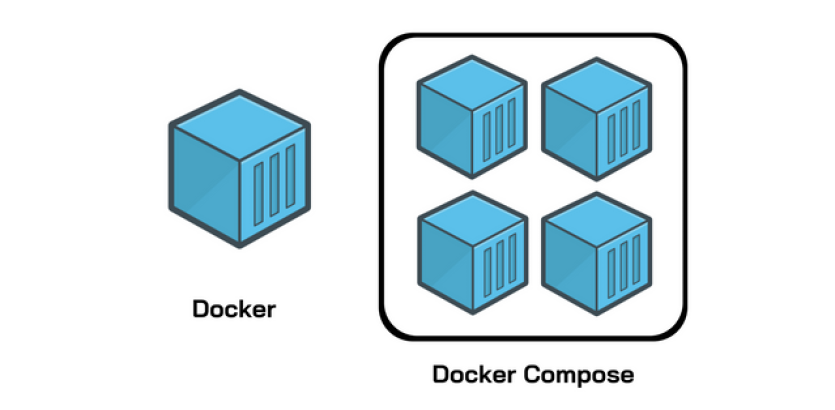

# Docker Compose

## docker vs docker compose

- docker run is entirely command line based, while docker-compose reads configuration data from a YAML file.

- When write all the containers that mention in the docker docker-compose file it will be automatically placed in a same network

## Commands

- **docker-compose -f [example.yaml] up**  = to create and start containers

- **docker-compose -f [example.yaml] down** = Stop and remove containers, networks
